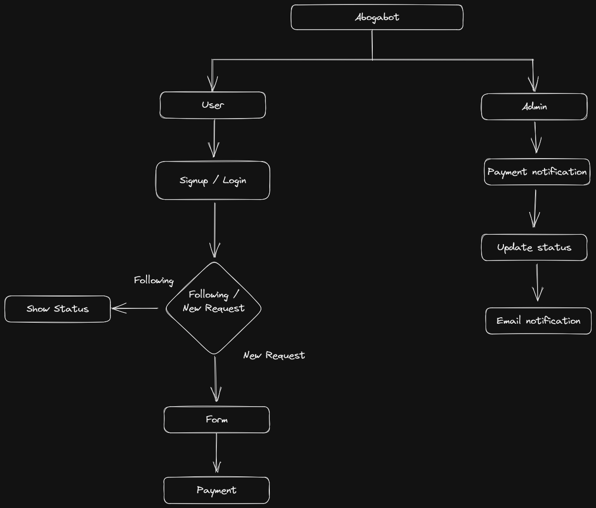

# ABOGABOT PROYECT DESIGN

**1.** [Overview](#overview)
**2.** [Summary](#summary)
**3.** [Flow Chart](#flow-chart)

## Overview

- **Project name:** Abogabot
- **Requirement:** Automate the demand creation process

## Summary

- **Requirement description**
  - Create a web page in which the client is able to create a demand by filling out a form and a payment from the web itself.

  - The Admin must be able to see the payments of the customer and then create a case that will be updated at every step of the legal process.

  - The customer should be able to login to their account, and they must be able to see the status of their legal process.

## Flow Chart

